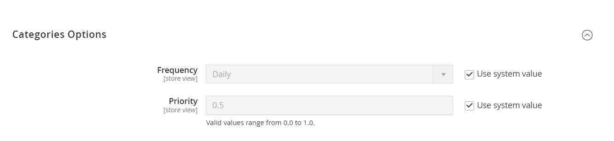
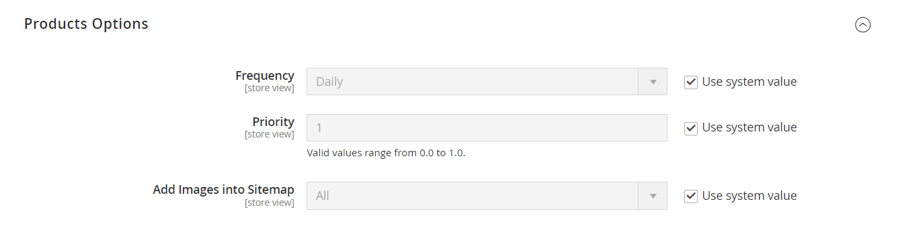
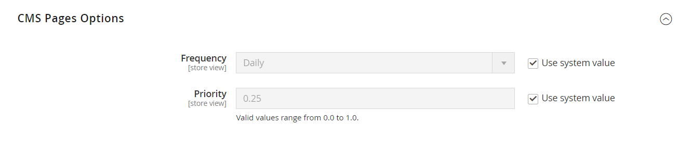
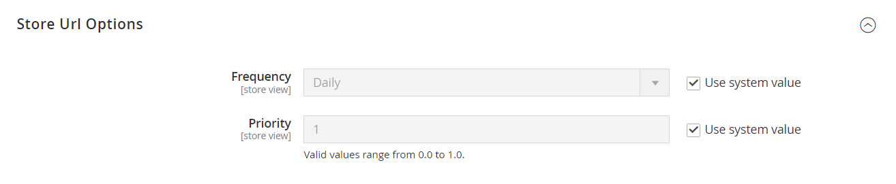
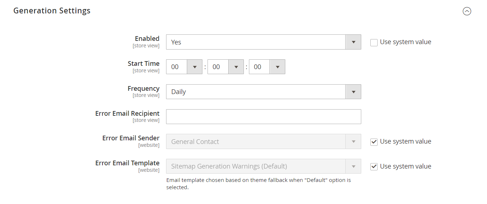
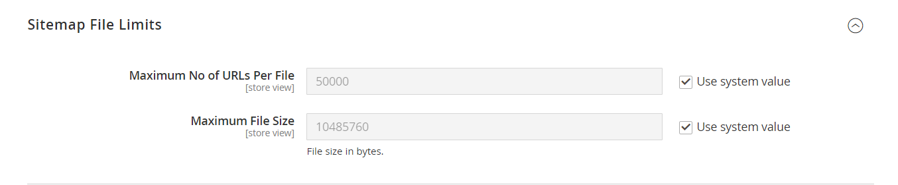
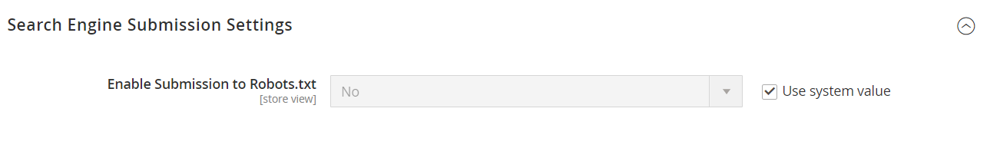

# Magento 2 XML Sitemap Extension

Empower your Magento 2 store's SEO performance by automating the generation of XML sitemaps, ensuring better search engine visibility. The Magento 2 XML Sitemap Extension helps you easily manage and optimize your XML sitemaps for Google and other search engines, leading to improved indexing and search rankings.

## Key Features:

- **Automated XML Sitemap Generation:**
Automatically generate XML sitemaps for products, categories, CMS pages, and custom URLs.
- **Priority and Frequency Settings:**
figure the priority and frequency settings for different types of pages (e.g., product, category, CMS pages) to guide search engines on how often pages should be crawled.
- **Multiple Store Support:**
Generate separate sitemaps for each store view to manage multi-language or multi-region stores efficiently.
- **Custom URL Support:**
Add any custom URLs to the XML sitemap that are not automatically included by default.
- **Exclude Pages:**
Exclude specific products, categories, or CMS pages from the sitemap based on your requirements.
- **Split Large Sitemaps:**
Automatically split large sitemaps into smaller files to stay within search engine limits and ensure efficient crawling.
- **Sitemap Index File:**
Generate a sitemap index file that links to all individual sitemaps for seamless submission to search engines.
- **Cron Job Support:**
Set up a cron job to automate the sitemap generation process at regular intervals, ensuring your sitemap is always up-to-date.

## Benefits:

- **Enhanced SEO Visibility:**
Ensure that all important pages of your website are indexed by search engines, improving SEO and search rankings.
- **Better Search Engine Crawling:**
Guide search engines on how frequently your pages are updated, optimizing how your site is crawled.
- **Improved User Experience:**
Ensure that search engine users can easily find the latest versions of your products and content in search results.

## Compatibility:
This extension is compatible with Magento 2.x versions, ensuring seamless integration with your existing store setup.

## Installation:
**Install via composer (recommend)** - 

Easy installation process with step-by-step instructions provided for hassle-free setup.
~~~~~~~~~~~~~~~~~~~~~
composer require mavenbird/module-xml-sitemap
php bin/magento setup:upgrade
php bin/magento setup:di:compile
php bin/magento setup:static-content:deploy
php bin/magento cache:flush
~~~~~~~~~~~~~~~~~~~~~

## Upgrade/Update Module:
Run the following command in Magento 2 root folder for easy update -
~~~~~~~~~~~~~~~~~~~~~
composer update mavenbird/module-xml-sitemap
php bin/magento setup:upgrade
php bin/magento setup:di:compile
php bin/magento setup:static-content:deploy
php bin/magento cache:flush
~~~~~~~~~~~~~~~~~~~~~

## Customization Options:

- **Customizable Sitemaps:**
Tailor the settings for frequency, priority, and exclusions to match your store's SEO strategy.
- **Custom URL Integration:**
Easily add additional URLs to the sitemap, such as landing pages or special campaign URLs.

**Configure at Your Ease**

## Support:
Dedicated support team available to assist with installation, customization, and any other queries or concerns.
**[support@mavenbird.com](mailto:support@mavenbird.com)** 

## Get Started:
Optimize your store's SEO and improve your search engine visibility by setting up the Magento 2 XML Sitemap Extension today!

**Thank you!**